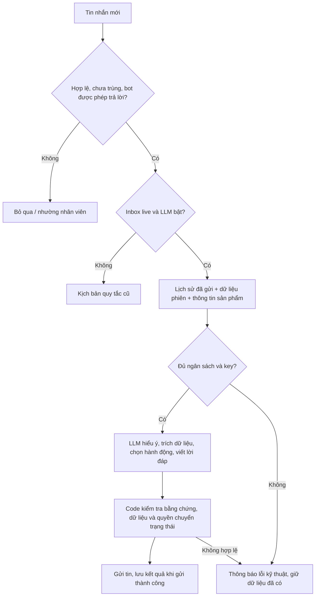

# Luồng bán hàng có ngữ cảnh

## Chọn bộ xử lý

Với page có `sales_script`, inbox live và `llm.enabled: true`, `bot.py` gọi trực tiếp
`dialogue.respond()`. Bộ quy tắc `sales.decide()` và `llm.assist()` cũ không chạy
trước hoặc sau LLM. Không còn cơ chế thêm regex để chọn câu clarification mẫu.

Khi `enabled: false`, bot dùng kịch bản quy tắc cũ. Comment vẫn dùng quy tắc để mời
khách vào inbox, không thu thập SĐT/địa chỉ công khai. Dry-run và `simulate` chỉ chạy
quy tắc, không mô phỏng chất lượng câu trả lời của LLM và không tốn phí API.



## LLM hiểu cuộc trò chuyện như thế nào?

Mỗi tin hợp lệ được xử lý một lần bằng Responses API, JSON Schema strict.
Context gồm tin hiện tại, các lượt gần nhất của đúng page/conversation/phiên mua,
câu bot thực sự đã gửi, dữ liệu đã lưu, câu hỏi hoặc đề nghị đang chờ, đơn cũ,
màu có bán, dữ liệu sản phẩm và FAQ đã duyệt. Giới hạn `history_turns` tính theo
số tin khách trước đó; mỗi tin có thể kèm nhiều phần trả lời của bot.
Khi vượt giới hạn byte, bỏ lịch sử cũ nhất trước; không cắt mất tin hiện tại.

LLM quyết định ý nghĩa và viết câu tư vấn/hỏi lại theo ngữ cảnh. `question` chỉ là
nhãn nội bộ để hiểu câu trả lời tiếp theo, không chọn câu hỏi mẫu theo nhãn đó.
Không tự chuyển nhân viên chỉ vì khách hỏi nhiều câu. Khách yêu cầu nhân viên,
khiếu nại hoặc việc ngoài khả năng vẫn có thể chuyển `human`.

Ví dụ mong đợi (lời thực tế do model tạo):

| Hội thoại | Hành vi |
| --- | --- |
| Bot hỏi cân nặng, khách nói “55” | Lưu 55kg, tư vấn size; chưa coi đó là chọn size. |
| Bot chỉ gợi ý M, khách nói “ừ em” | Có thể nhận M từ đề nghị vừa hiển thị. |
| Bot hỏi “M hay L?”, khách nói “ừ em” | Chưa có lựa chọn duy nhất; cần hỏi rõ. |
| “Không phải mẫu đó, mẫu vừa gửi cơ” | Dựa lịch sử để hỏi rõ mẫu, không tự chọn size/màu. |
| “Lấy M, giao có được kiểm hàng không?” | Ghi lựa chọn rõ ràng, trả chính sách có trong FAQ; không bịa chính sách. |
| Đang chờ tổng hợp, khách nói “ừ em” | Xác nhận đúng bản tổng hợp đang chờ; không đòi một câu khóa cố định. |
| “Ok nhưng đổi sang L” | Sửa L và gửi lại tổng hợp, chưa chốt. |
| “Không cần gọi, nhắn đây giúp chị” | Hiểu phủ định theo ngữ cảnh, không dừng vì từ “gọi”. |

Model vẫn có thể hiểu sai. JSON strict đảm bảo cấu trúc, không đảm bảo hiểu đúng
mọi câu. Code kiểm soát dữ liệu và chuyển trạng thái; cần đối chiếu log khi kiểm thử
các cách nói thực tế của khách.

## Dữ liệu, xác nhận và mua lại

- Mỗi cập nhật cần bằng chứng từ lời khách. Size/màu phải hợp lệ; SĐT được kiểm tra
  định dạng; địa chỉ phải là nội dung khách cung cấp, không tự hoàn thiện địa chỉ.
  Địa chỉ chưa được xác minh bằng bản đồ. Số lượng mặc định 1; thay đổi phải có bằng chứng.
- Size được gợi ý không phải size đã chọn. Chấp nhận đồng ý ngắn chỉ khi có một
  size duy nhất thực sự hiển thị ở câu hỏi trước.
- Đủ size, màu nếu có, SĐT, địa chỉ và số lượng: code hiển thị bản tổng hợp chính xác.
  Xác nhận chỉ có hiệu lực với bản tổng hợp đang chờ, không có thay đổi trong cùng tin.
- Lời tư vấn do LLM viết. Nội dung giao dịch gồm tổng hợp, hỏi mở phiên, hỏi dùng lại
  dữ liệu và biên nhận xác nhận do code hiển thị để khớp dữ liệu thực tế.
- `complete` là đã thu thập và xác nhận thông tin nội bộ. Chưa tạo đơn, giữ hàng,
  gọi điện, hủy đơn hoặc gán nhân viên qua Pancake API.
- Sau `complete`/`stopped`, khách muốn mua thêm: hỏi mở phiên mới. Đồng ý mới tạo
  `session_id` mới và hủy nhắc của phiên trước; không ghi đè đơn cũ.
- Thông tin `last_order` chỉ chép vào phiên mới sau đề nghị dùng lại chỉ rõ các trường
  và khách đồng ý. Cuối cùng vẫn phải xác nhận tổng hợp đơn mới.
- `sales_history` lưu bản chụp complete/stopped riêng theo page/conversation/session.
  Không khôi phục được dữ liệu đã xóa trước khi có lịch sử.
- Hội thoại có người phụ trách (`skip_assigned: true`), stop tag hoặc lead `human`
  thực sự luôn nhường nhân viên, kể cả khách muốn mua lại.
- Gửi thất bại không ghi nhận câu hỏi/xác nhận chưa gửi là đã gửi và không cập nhật
  lead theo phản hồi thất bại. Không tự gửi lại để tránh trùng tin.

## Cấu hình và chi phí

Khối cấu hình trong `pages["ID_PAGE"].llm`:

```json
"llm": {
  "enabled": true,
  "model": "gpt-5.4-nano",
  "api_key": "DIEN_KEY_CUA_BAN",
  "api_key_env": "OPENAI_API_KEY",
  "daily_budget_usd": 1.0,
  "max_calls_per_conversation": 10,
  "timeout_seconds": 10,
  "max_output_tokens": 1024,
  "max_input_bytes": 24000,
  "history_turns": 8,
  "faq": []
}
```

Key từ config được ưu tiên; ENV chỉ là dự phòng khi key trong config trống.
Đổi `enabled` thành false để về kịch bản quy tắc. Khởi động lại bot sau khi sửa.
Không cần cài thư viện mới. Tính năng mặc định tắt trong cấu hình mẫu.

Khác luồng dự phòng trước đây, mọi inbox hợp lệ trong chế độ này đều cần LLM để
hiểu toàn câu; không chặn trước bằng từ khóa FAQ hoặc câu xác nhận. Giá và FAQ
vẫn là dữ liệu cố định. Mỗi lượt tối đa một request, không tự retry. Chi phí có thể
cao hơn bộ quy tắc; giữ lịch sử ngắn và output có giới hạn để kiểm soát.

`daily_budget_usd` áp dụng theo page/ngày UTC. `max_calls_per_conversation` giữ tên
cũ nhưng tính theo phiên mua, gồm cả lượt lỗi. Mở phiên mới có hạn mức lượt mới,
không đặt lại ngân sách ngày. Các tiến trình phải dùng chung SQLite để chia sẻ
ngân sách. Khởi động lại và reset-state không xóa lịch sử phí.

SQLite giữ chỗ chi phí trước khi gọi, cập nhật usage sau phản hồi. Timeout/mất kết
nối giữ khoản dự phòng vì không biết API đã tính phí chưa. Công thức nội bộ hiện
là 0,20 USD/triệu input token và 1,25 USD/triệu output token cho model nano được
hỗ trợ trong code; cần cập nhật khi giá thay đổi. Đây không phải hạn mức tài khoản
OpenAI. Key không được đưa vào prompt hoặc DB. Context có thể chứa SĐT/địa chỉ
và lịch sử khách; API dùng `store: false`.

Thiếu key, hết ngân sách, timeout hoặc kết quả không hợp lệ: không chạy lại regex
để đoán ý khách. Bot giữ dữ liệu và thông báo trục trặc ở phiên đang hoạt động;
không tự chốt, tự chuyển nhân viên hay tự thử lại. Phiên đã complete/stopped/human
không gửi thông báo lỗi này. Ngân sách 0 chặn toàn bộ API.

## Sản phẩm và FAQ

`sales-script.json` có cấu hình riêng cho từng page. `groups` lấy từ `reply-quicks.md`
(TSV), giữ nhóm giá/chất liệu/bảng size và URL ảnh. `dialogue.facts_for()` đưa nội
 dung được duyệt vào context; LLM chọn ID và code chèn nguyên văn. Model không được
thay giá/chính sách. Validator chặn một số giá/cam kết trong lời tự do nhưng không
thể chứng minh mọi phát biểu bằng ngôn ngữ tự nhiên đều đúng.

`product.colors: []` không hỏi màu. Nếu có danh sách màu thì màu là trường bắt buộc.
Hiện mỗi page có một cấu hình sản phẩm; chưa tự chọn sản phẩm theo bài đăng, chưa
hiểu ảnh khách gửi. Ảnh trả khách chỉ lấy từ URL cấu hình; upload và cache theo page.

Ví dụ phần tử trong `llm.faq`:

```json
{
  "id": "kiem_hang",
  "keywords": ["kiểm hàng"],
  "answer": "ĐIỀN CHÍNH SÁCH ĐÃ ĐƯỢC SHOP DUYỆT"
}
```

`keywords` được giữ để tương thích cấu hình cũ; luồng mới chọn FAQ theo ngữ cảnh,
không cắt ngang toàn tin bằng từ khóa. Không điền chính sách khi chưa có thông tin.
Các `prompts` cũ chỉ điều khiển nhánh quy tắc, không điều khiển lời hỏi tự nhiên.

## Chạy và xem thông tin

```powershell
python bot.py poll --live --log-level INFO
python bot.py status --live
python bot.py leads --live
python bot.py orders --live
python bot.py llm-usage --live
```

Dừng tiến trình cũ bằng Ctrl+C trước khi chạy lại; không cần reset dữ liệu.
Polling chỉ nhận tin đã đồng bộ vào Inbox Pancake của đúng page. Tin chỉ hiện trên
Messenger/Facebook chưa được Pancake cung cấp thì bot chưa thể xử lý.

## Log plain text để đối chiếu hội thoại

Mức INFO ghi terminal và `logs/pancake.log`, xoay vòng theo cấu hình logging.

```powershell
Get-Content .\logs\pancake.log -Encoding utf8 -Tail 200 -Wait
```

Mỗi khối có page/conversation/message để đối chiếu:

| Mốc | Ý nghĩa |
| --- | --- |
| `dialogue_request` | Context, instructions, schema gửi model; không chứa key. |
| `dialogue_interpretation` | JSON model đã trả. |
| `dialogue_decision` | Kết quả sau kiểm tra, nội dung dự định gửi và lead đề xuất. |
| `dialogue_failure` | Lỗi API/parse/validation. |
| `dialogue_unavailable` | Thiếu key, giới hạn input, hết ngân sách hoặc trùng lượt. |
| `send_status` | Trạng thái gửi Pancake thực tế; decision chưa phải bằng chứng đã gửi. |

Log có thể chứa SĐT/địa chỉ. Key/token đã đăng ký được che. Không chia sẻ nguyên
log ra ngoài nếu chưa loại dữ liệu riêng tư.

## Kiểm thử

```powershell
python -m unittest discover -s tests
python tests/smoke_dialogue.py --live-llm
```

Unit test không gọi API. Smoke test dùng hội thoại giả, DB tạm, API thật với ngân
sách riêng tối đa 0,05 USD mỗi lần; không gửi tin Pancake. Kiểm tra cả chuỗi chọn
size, xác nhận đơn, mở phiên mua lại và đồng ý dùng lại thông tin.
