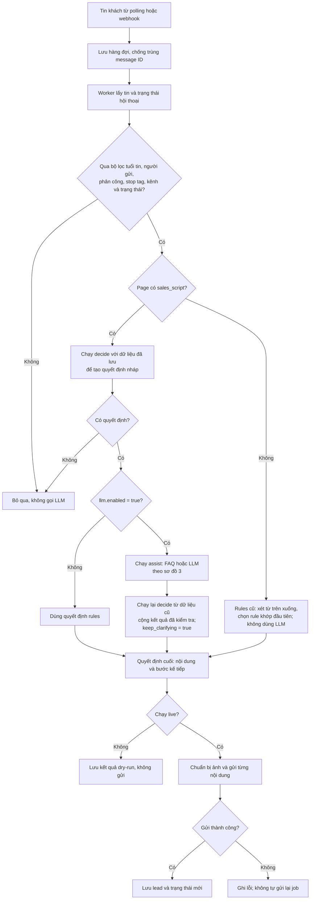
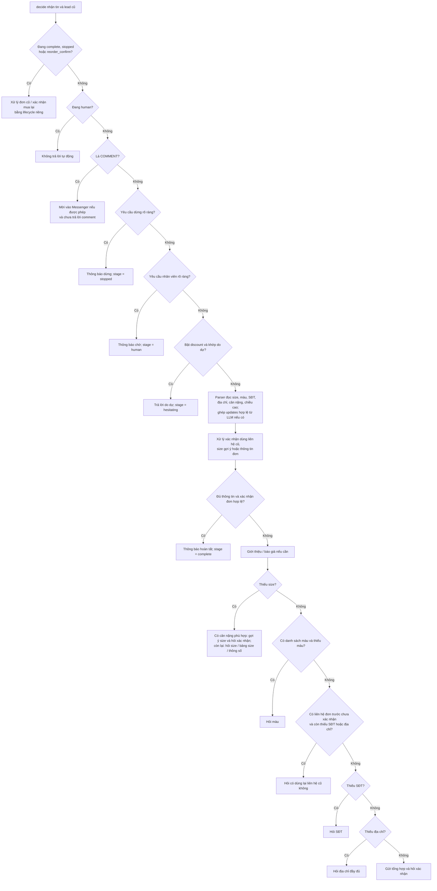
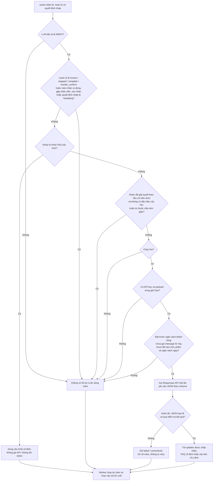

# Kịch bản từ reply-quicks.md

Nguồn được đọc dạng TSV (cột ngăn bằng tab), hỗ trợ message nhiều dòng trong dấu
ngoặc kép. Sắp xếp số `quickReplyIndex` tăng dần, giữ thứ tự các dòng cùng index.
File gốc không bị sửa. Bản dùng thực tế là `sales-script.json`, đã gắn vào các page
trong `config.json` qua `sales_script`. Khi bật chế độ này, rules mẫu cũ không chạy.

| Index | Nội dung gốc | Cách sử dụng |
| --- | --- | --- |
| 0 | CMT | Comment: mời khách vào Messenger. Đã đổi câu “đã gửi tin nhắn” vì bot chưa gửi inbox từ comment trong luồng này. Không xin SĐT/địa chỉ công khai. |
| 1 | gọi | Giữ nguyên mẫu trong file, không tự phát. Khách yêu cầu gọi sẽ nhận thông báo chờ nhân viên; tool không có chức năng gọi điện. |
| 2 | g, 4 dòng | Báo giá → 3 ảnh → chất liệu → hỏi chiều cao/cân nặng. Bỏ câu hỏi cuối nếu đã có size/cân nặng. |
| 3 | bảng size | Hiện khi khách hỏi size hoặc cung cấp cân nặng. |
| 4 | chọn size | Dùng cùng bảng size khi khách hỏi size. |
| 5 | hỏi chiều cao/cân nặng | Hỏi lại khi vẫn chưa có dữ liệu xác định size. |

Index quy định thứ tự mẫu và thứ tự trong nhóm, không có nghĩa phát cả 0→5 cho mọi
khách. Tên `shortcut` là tên mẫu nội bộ, không dùng ký tự `g`, `e`, dấu phẩy làm từ
khóa vì sẽ khớp nhầm gần như mọi tin nhắn.

## Luồng inbox

1. Lần đầu hoặc khách hỏi `giá`, `bao nhiêu`, `xin ảnh`, `xem ảnh`, `chất liệu`, `vải gì`:
   gửi nhóm 2 theo đúng thứ tự. Thay `#{FULL_NAME}` bằng tên người gửi.
2. Nhận size khách chọn: `size M`, `sz XL`, `2XL`, `lấy L`, `M nhé`…
   Hoặc nhận cân nặng `55kg`, `55 ký` và chiều cao `1m60`, `160cm`.
   Gợi ý theo bảng gốc, yêu cầu xác nhận size; không coi cân nặng là quyết định size.
   Cân nặng ngoài bảng hoặc khoảng trống như 48,5kg cần chọn size hoặc hỏi nhân viên.
3. Chưa có SĐT: hỏi SĐT. Nhận số di động Việt Nam 10 chữ số bắt đầu 03/05/07/08/09,
   hỗ trợ +84, dấu cách/chấm/gạch ngang. Không tự chọn nếu có nhiều số khác nhau.
4. Chưa có địa chỉ: xin số nhà/đường hoặc thôn/ấp, phường/xã, tỉnh/thành phố.
   Nhận địa chỉ có nhãn “địa chỉ: …”, “giao đến …” ở bất kỳ bước nào, hoặc câu trả lời
   sau khi bot hỏi địa chỉ. Địa chỉ cần đủ dấu hiệu chi tiết và địa phương; địa chỉ viết
   tắt không rõ có thể bị hỏi lại. Đây là kiểm tra bằng quy tắc, không xác minh bản đồ.
5. Đủ size + SĐT + địa chỉ: gửi tổng hợp, đợi `đúng rồi`, `chính xác`, `xác nhận`, `ok`…
   Khách có thể gửi `đổi size M`, số mới hoặc `địa chỉ: …` để sửa và xác nhận lại.
6. Khách xác nhận: lưu `complete` và bản chụp thông tin vào `sales_history` để nhân
   viên kiểm tra sản phẩm/xác nhận đơn. Kết thúc phiên mua hiện tại; khách có thể chủ
   động nhắn “mua lại” để mở phiên mới sau khi xác nhận. Chưa tạo đơn hoặc gán nhân
   viên qua Pancake API.

Các trường được ghi nhớ riêng theo page/conversation; khách cung cấp sớm sẽ không phải
nhập lại. Comment và inbox có thể có conversation ID khác nhau nên không tự nối dữ liệu.
`nhân viên`, `khiếu nại`, `gọi cho chị`, `gọi điện` → dừng bot chờ người hỗ trợ.
`không mua`, `không cần`, `dừng nhắn`, `hủy đơn` → dừng bot (không tự hủy đơn thực tế).

Bot chỉ nhận yêu cầu dừng rõ ràng, không dừng chỉ vì câu chứa từ khóa. Ví dụ
“không cần gọi đâu, nhắn ở đây giúp chị”, “chị không muốn hủy đơn” và “không cần
nhân viên đâu” không làm dừng bot. Hỗ trợ “ko mua nữa”, “hủy đơn giúp chị”.
Đây vẫn là nhận diện theo mẫu, chưa phải AI hiểu mọi cách diễn đạt.

Chọn size hỗ trợ “chị lấy M nhé”, “M nhé!”, “cho chị size XL nha”. Câu “size M,
ship bao lâu?” ghi nhận M từ phần chọn size; bot chưa có câu trả lời riêng về giao
hàng. Không tự chọn từ “size M hay L”, “size M/L”, câu hỏi hoặc phủ định về size.
Xác nhận hỗ trợ “ok shop”, “đúng rồi em”, “dạ chính xác ạ”, “chốt nhé shop” và 👍,
chỉ có hiệu lực ở bước xác nhận size gợi ý hoặc xác nhận thông tin đơn. Câu chứa
yêu cầu sửa thêm không tự chốt đơn.

Khi LLM tắt, sau 3 câu trả lời liên tiếp không bổ sung/sửa được thông tin và vẫn ở cùng một
bước, bot gửi thông báo chờ nhân viên thay cho lần hỏi tiếp theo, lưu `human` cùng
`handoff_reason: repeated_unresolved_input`. Lần hỏi ban đầu không tính vào bộ đếm;
có thông tin mới hoặc chuyển bước sẽ đặt lại `repeat_count` về 0. Bộ đếm lưu trong
lead SQLite; cùng message ID không được tính lại. Áp dụng cho size, xác nhận size,
màu, SĐT, địa chỉ và xác nhận đơn. Có thể sửa lời thông báo bằng
`prompts.repeated_handoff` trong kịch bản của page.
Chuyển nhân viên chỉ dừng bot và thông báo chờ, chưa gán nhân viên qua API.
Khi LLM bật trong worker, các bước thu thập thông tin tiếp tục hỏi theo ngữ cảnh,
kể cả khi LLM không gọi được hoặc chưa hiểu; riêng xác nhận mua lại có cơ chế riêng.

## Sơ đồ rules và LLM — đối chiếu code hiện tại

Các sơ đồ dưới đây mô tả `process_one()` trong `bot.py`, `decide()` trong
`sales.py` và `assist()`/`validate_result()` trong `llm.py`. “Rules” trong luồng
bán hàng là bộ quy tắc Python + mẫu trong `sales-script.json`; không phải mảng
`rules` cũ trong config. Quyết định lần đầu chỉ là bản nháp, chưa gửi cho khách.

### 1. Luồng tổng thể của một tin khách



### 2. Thứ tự ưu tiên trong rules bán hàng



Khách có thể cung cấp nhiều trường trong một tin hoặc cung cấp sớm; rules lưu
những trường đọc được rồi chọn câu hỏi kế tiếp theo thứ tự trên. Cuối luồng,
bot cập nhật bộ đếm hỏi lặp. Khi LLM tắt, 3 lần không tiến triển trong cùng bước
thu thập thông tin chuyển `human`; khi bật, worker chạy lại rules với
`keep_clarifying = true` để tiếp tục hỏi. FAQ được thêm trước câu hỏi kế tiếp;
nếu không có FAQ thì có thể thêm câu làm rõ ý định do code quy định.

### 3. Khi nào thực sự gọi LLM?



Tiêu chí chính xác đang dùng trong code:

| Điều kiện | Cách kiểm tra hiện tại |
| --- | --- |
| Có thay đổi dữ liệu | Ít nhất một trường size, màu, SĐT, địa chỉ, cân nặng, chiều cao khác lead cũ. |
| Đã giải quyết (`resolved`) | Có thay đổi dữ liệu **và** một trong ba điều kiện: bước cũ không ánh xạ tới trường cần hỏi; trường đang cần đã đổi; hoặc stage nháp đã đổi. Đây là heuristic, không phải kiểm tra đã hiểu hết từng câu. |
| Trường đang cần | `size`/`size_confirm` → size; `color` → màu; `phone` → SĐT; `address` → địa chỉ. Các bước khác để trống. |
| Có dấu hiệu câu hỏi | Có `?` hoặc từ/cụm `ship`, `bao lâu`, `bao nhiêu`, `đổi trả`, `kiểm hàng`, `không`, `sao` sau chuẩn hóa. |
| Mẫu đơn giản | Các mẫu khớp toàn tin như `giá`, `xin giá`, `ảnh`, `xin ảnh`, `bảng size`, `chào`, `hi`, `hello`, `alo` và biến thể được regex hỗ trợ. Không phải mọi câu hỏi giá đều được bỏ qua LLM. |
| FAQ trực tiếp | Chỉ cần một từ khóa FAQ khớp; trả FAQ trước khi xét phần câu còn lại. Nếu tin vừa khớp FAQ vừa có thông tin mơ hồ, hiện tại không gọi thêm LLM cho phần mơ hồ đó. |

### 4. LLM nhận gì và kết quả được dùng thế nào?

LLM nhận tin hiện tại, bước đang chờ, size/màu/cân nặng/chiều cao/size gợi ý đã
lưu, cờ có SĐT/địa chỉ, trường đang cần, cập nhật parser vừa đọc, danh sách màu
và chủ đề FAQ. Không gửi toàn bộ lịch sử; SĐT/địa chỉ cũ chỉ biểu diễn bằng cờ.
SĐT/địa chỉ vừa cung cấp có thể có trong tin hiện tại và `parser_updates`.

| Kết quả từ LLM | Cách xử lý |
| --- | --- |
| `updates` | Mỗi trường cần giá trị và `evidence` trích nguyên văn từ tin hiện tại. Code kiểm tra lại; giá trị không đạt bị bỏ. Chỉ các trường cho phép mới được dùng. |
| `needs_clarification = true` | Bỏ toàn bộ cập nhật **từ LLM**; thông tin parser đã đọc vẫn được giữ. FAQ hợp lệ hoặc câu làm rõ ý định vẫn có thể được sử dụng. |
| Size / màu | Phải thuộc danh sách cho phép, có chứng cứ; loại câu phủ định, lựa chọn nhiều phương án, câu hỏi theo các chốt kiểm tra hiện có. Màu còn phải qua parser màu. |
| SĐT / địa chỉ | Phải qua validator của parser; LLM không tự hoàn thiện địa chỉ thiếu hoặc vượt qua kiểm tra SĐT. |
| Cân nặng / chiều cao | Đối chiếu số parser đọc được từ tin và chứng cứ. Riêng số trần như `55` được nhận là cân nặng tại `size`/`size_confirm`, trong khoảng 20–250. |
| `faq_ids` | Chỉ nhận ID đã cấu hình và lấy nguyên câu trả lời cố định; ID lạ làm kết quả thất bại. |
| `intent = confirm / stop / human` | Không thực hiện hành động theo model. Bỏ updates từ model và dùng câu làm rõ cố định, yêu cầu khách xác nhận bằng câu rules hiểu được. |
| Không còn kết quả hữu ích | Ghi `unresolved`, hỏi tiếp theo rules. |
| Timeout, refusal, JSON/schema lỗi | Ghi `failed`, hỏi tiếp theo rules; không tự retry cuộc gọi trả phí. |

LLM không viết câu trả lời tự do, không tự chốt đơn và không tự đổi giá/chính sách.
Kết quả `accepted` trong bảng `llm_calls` nghĩa là có hỗ trợ hợp lệ, không có nghĩa
khách đã được hiểu đầy đủ hay đơn đã chốt. Chi phí có usage được ghi theo usage;
nếu thiếu usage hoặc timeout thì giữ khoản ngân sách đã đặt trước.

### 5. Các tình huống để kiểm tra lại

Các dòng “Có” bên dưới giả định live, LLM bật, có key, đủ ngân sách và chưa trùng
message ID. Kết quả LLM là giả định để minh họa, không đảm bảo model luôn trả như vậy.

| Bước hiện tại / tin khách | Gọi LLM? | Kết quả mong đợi theo code |
| --- | --- | --- |
| Hỏi size → `size M` | Không | Parser nhận M, hỏi trường còn thiếu kế tiếp. |
| Hỏi size → `55` | Có | Nếu model trả cân nặng 55 có chứng cứ: gợi ý M và hỏi xác nhận; chưa chốt size. |
| Hỏi size → `L cho chị nha, 0912345678` | Có | Parser đọc SĐT nhưng chưa đọc được size; model có thể bổ sung L hợp lệ. |
| Hỏi size → `M hay L` | Có | Không tự chọn M hoặc L; tiếp tục hỏi size rõ ràng. |
| Hỏi size → `size M, ship bao lâu?` | Có nếu chưa khớp FAQ trực tiếp | Giữ M parser đã đọc; model chỉ trả lời giao hàng nếu chọn được FAQ đã cấu hình. |
| Bất kỳ bước đang tư vấn → khớp từ khóa FAQ | Không | Trả FAQ cố định rồi hỏi thông tin còn thiếu. |
| Đang confirm → `ừ em` | Có | Nếu model đề xuất confirm, bot hỏi khách nhắn `đúng rồi`; chưa hoàn tất đơn. |
| Đang confirm → `đúng rồi` | Không | Rules hoàn tất nếu các trường bắt buộc đủ và không thay đổi. |
| Đang hỏi địa chỉ → địa chỉ thiếu thông tin | Có | Nếu validator không nhận thì tiếp tục xin địa chỉ đầy đủ. |
| Chưa hiểu sau nhiều lần, LLM timeout/hết ngân sách | Không gọi được hoặc cuộc gọi thất bại | Khi LLM bật, tiếp tục hỏi trong luồng thu thập thông tin; không tự chuyển human vì bộ đếm 3 lần. |
| Khách nhắn `không mua` / `nhân viên` rõ ràng | Không | Dừng / chuyển chờ nhân viên theo rules. |
| Đang `reorder_confirm` → câu mơ hồ | Không | Lifecycle hỏi xác nhận mua lại; sau 3 lần chưa rõ vẫn chuyển nhân viên. |

**Các giới hạn cần lưu ý khi duyệt flow:** rules vẫn dùng heuristic để quyết định
có cần LLM; việc chuyển stage có thể khiến một phần mơ hồ không được kiểm tra thêm.
Xác nhận chuẩn được bỏ qua LLM ở mọi bước, dù ở bước đó nó chưa bổ sung thông tin.
LLM cũng không đọc toàn bộ lịch sử trò chuyện, nên “theo ngữ cảnh” hiện tại là theo
stage và dữ liệu đã lưu. `poll`/`serve` dry-run không gọi API nhưng vẫn chạy worker;
`simulate` chỉ chạy quyết định rules trực tiếp, không chạy nhánh `assist` và
`keep_clarifying` của worker.

## Chạy và xem thông tin

```powershell
python bot.py poll
python bot.py status
python bot.py leads
```

Chỉ bật `python bot.py poll --live` khi muốn gửi thật; xem bằng `status --live` và
`leads --live`. Khởi động lại tiến trình đang chạy để nhận cấu hình/code mới.
Conversation có state `human` từ kịch bản cũ nhưng lead `complete`/`stopped` được
nhận diện để xử lý yêu cầu mua lại, không cần reset. Lead `human` thực sự vẫn nhường
nhân viên và không tự mở lại. `reset-state` xóa lead hiện tại nhưng không xóa lịch sử
đã lưu; không dùng lệnh này làm luồng mua lại thường xuyên.

Ảnh được tải và upload vào Pancake khi gửi live lần đầu, cache content ID riêng từng
page trong SQLite. Dry-run không tải/upload/gửi ảnh. Text và ảnh gửi bằng request riêng.
Chỉ hỗ trợ URL ảnh HTTPS trên `content.pancake.vn` trong kịch bản này, tối đa 10 MB/ảnh.
Nếu ảnh bị xóa hoặc upload lỗi, bot dừng chuỗi và chuyển error; bảng `deliveries` ghi
trạng thái từng phần. Không tự thử lại chuỗi đã gửi dở. Tin mới của khách có ID khác
vẫn được xử lý, kể cả lặp lại “xin giá”; chỉ cùng message ID mới bị chống trùng.

## Kịch bản riêng theo page và màu sắc

Trong `sales-script.json`, mỗi khóa của `pages` là ID page trùng với `config.json`.
Page hiện tại: `pages["122526837503326"]`. Mỗi page có `groups`, `prompts` và
`product` riêng; không dùng kịch bản của page khác khi thiếu ID (bot báo lỗi cấu hình).
Để thêm page, sao chép toàn bộ khối page hiện tại sang ID mới, sửa giá/ảnh/lời thoại,
và đặt `sales_script: "sales-script.json"` cho page đó trong `config.json`.
File kịch bản kiểu cũ chỉ có `groups`/`prompts` vẫn được hỗ trợ.

Sửa `product` của page cần hỏi màu, ví dụ:

```json
"product": {
  "colors": ["Đỏ", "Xanh", "Trắng"]
}
```

`colors: []` (mặc định hiện tại) hoặc bỏ trường này: không hỏi màu.
Danh sách có màu: bắt buộc chọn màu sau size, trước SĐT/địa chỉ; khách cung cấp
`màu đỏ` sớm sẽ được ghi nhớ. Bot chỉ nhận một màu nằm trong danh sách, không tự
chọn từ câu hỏi/phủ định/nhiều lựa chọn. Khách sửa bằng `đổi màu xanh`.
Màu được lưu cùng lead và có trong tin tổng hợp trước khi xác nhận hoàn tất.
Mỗi page hiện dùng một cấu hình sản phẩm; chưa tự chọn sản phẩm theo bài đăng.

Sửa `pages["ID_PAGE"].prompts.color` để đổi câu hỏi, dùng `{colors}` để chèn danh sách.
`prompts.confirm` có thể dùng `{color}`; nếu chưa thêm, bot tự thêm màu vào đầu tin.
Chỉnh các lời hỏi khác trong `pages["ID_PAGE"].prompts`, giá/ảnh trong `groups`.
Khởi động lại bot để áp dụng thay đổi.

Sau khi sửa file gốc, xuất ra file tạm rồi chép groups vào page cần cập nhật (không ghi đè file nhiều page):

```powershell
python -c "from sales import compile_script; compile_script('reply-quicks.md', 'sales-script.imported.json')"
```

Mặc định chỉ dùng quy tắc: câu nhiều ý, phủ định phức tạp hoặc địa chỉ thiếu dấu hiệu
có thể cần nhân viên. Có thể bật LLM dự phòng theo hướng dẫn bên dưới.
Dữ liệu size/SĐT/địa chỉ lưu cục bộ trong SQLite, chưa
đồng bộ vào hồ sơ khách trên Pancake. Giữ DB riêng tư vì chứa thông tin khách hàng.

## LLM dự phòng: bật/tắt và ngân sách

### Log plain text để đối chiếu hội thoại

Khởi động lại bot để áp dụng. Log LLM hiện ở mức `INFO`, in ra terminal và file
UTF-8 `logs/pancake.log` theo cấu hình logging chung (xoay vòng 5 MB, giữ 5 bản).

```powershell
python bot.py poll --live --log-level INFO
```

Theo dõi từ cửa sổ PowerShell khác:

```powershell
Get-Content .\logs\pancake.log -Encoding utf8 -Tail 200 -Wait
```

Mỗi khối có `page`, `conversation`, `message` và dấu `END` để ghép đúng một lượt:

| Mốc log | Nội dung để kiểm tra |
| --- | --- |
| `llm_request` | Model, instructions, context thực gửi và schema. `input` hiển thị dạng object cho dễ đọc thay vì chuỗi JSON lồng; API key/header không được ghi. |
| `llm_response` | Response nhận từ API, gồm trạng thái, output và usage. |
| `llm_interpretation` | JSON model trả được giải mã, đọc tiếng Việt trực tiếp; chỉ có khi parse thành công. |
| `llm_validation` | Assistance được chấp nhận, updates bị loại kèm nhóm lý do, trạng thái accepted/unresolved và thời gian xử lý. |
| `llm_failure` | Loại lỗi, chi tiết lỗi và việc quay về rules. Lỗi HTTP có thêm response lỗi trong `llm_http_error`. |
| `llm_skip` / `llm_faq_local` | Vì sao không gọi API hoặc đã trả lời bằng FAQ trực tiếp. |
| `llm_final_decision` | Stage trước/sau, assistance và từng nội dung bot định gửi. Đây chưa phải xác nhận gửi thành công; đối chiếu `send_status` của worker. |

Log có nội dung khách, dữ liệu trích xuất và câu trả lời để kiểm tra; có thể gồm
SĐT/địa chỉ khách vừa cung cấp. API key/token đã đăng ký được che bằng `[REDACTED]`.
Khi chia sẻ log để chẩn đoán, chỉ cần lấy các khối cùng `conversation`/`message`.

Nếu `llm_response` thành công nhưng câu bot vẫn không phù hợp, đối chiếu lần lượt:
context có đủ ý khách không → model hiểu gì → validator bỏ gì → rules chọn câu nào.
Hiện LLM chỉ diễn giải dữ liệu/chọn FAQ, không soạn câu trả lời tự do; lời hỏi lại
vẫn là mẫu theo stage. Vì vậy API thành công không đồng nghĩa hội thoại tự nhiên.

Mỗi page trong `config.json` có khối `llm`; cấu hình thực tế và cấu hình mẫu đều
được thêm với `enabled: false`. Không có key mặc định và không gọi API khi tắt.
LLM chỉ dùng cho `sales_script`; rules kiểu cũ không hỗ trợ bật LLM.

```json
"llm": {
  "enabled": false,
  "model": "gpt-5.4-nano",
  "api_key": "",
  "api_key_env": "OPENAI_API_KEY",
  "daily_budget_usd": 1.0,
  "max_calls_per_conversation": 10,
  "timeout_seconds": 5,
  "max_output_tokens": 512,
  "max_input_bytes": 16000,
  "faq": []
}
```

Để bật: điền API key vào `pages["ID_PAGE"].llm.api_key` trong `config.json`, đổi
`llm.enabled` thành `true`, rồi khởi động lại bot. Key trong config được ưu tiên;
nếu để trống thì vẫn hỗ trợ biến môi trường `OPENAI_API_KEY` (hoặc tên trong
`api_key_env`). Để tắt: đổi `enabled` về `false` và khởi động lại. Key chỉ dùng cho
header Authorization, không đưa vào prompt/DB và được che trong log.
Không cần cài thêm thư viện Python. `poll --live` và `serve --live` mới được gọi
API trả phí; dry-run và `simulate` không gọi LLM. FAQ trực tiếp vẫn có thể được
xem trong dry-run khi tính năng bật; `simulate` chỉ chạy bộ quy tắc.

Luồng xử lý:

- Tin hợp lệ được xử lý bằng quy tắc trước. Thông tin giải quyết được bước đang chờ, lời chào, xin giá,
  xác nhận chuẩn, yêu cầu dừng/chờ nhân viên không cần gọi LLM.
- FAQ khớp từ khóa dùng nguyên câu trả lời cố định, không tốn token.
- Khi chưa hiểu hoặc có thêm câu hỏi, bot gọi Responses API một lần, dùng JSON
  Schema strict. Context gồm tin hiện tại, bước đang chờ, size/cân nặng/chiều cao,
  màu, trường đang cần, thông tin parser vừa đọc và danh sách chủ đề FAQ; không gửi toàn bộ lịch sử hoặc SĐT/địa chỉ cũ.
  Tin hiện tại có thể chứa thông tin cá nhân khách vừa cung cấp.
  Nếu parser chỉ đọc được một phần và vẫn chưa giải quyết bước đang chờ, bot cũng thử LLM.
- Code kiểm tra chứng cứ từ tin khách, danh sách size/màu, SĐT/địa chỉ; không nhận
  câu trả lời tự do của model. Ví dụ `55` tại bước hỏi size có thể được hiểu là
  55kg, nhưng vẫn yêu cầu khách xác nhận size được gợi ý.
- LLM không tự chốt đơn, dừng cuộc trò chuyện, gán nhân viên hay thay giá.
  Với ý xác nhận/dừng/gặp nhân viên chưa rõ, bot yêu cầu khách nhắn câu xác nhận
  rõ ràng. Những câu mơ hồ/phủ định phức tạp vẫn có thể bị từ chối cập nhật.
- FAQ trả lời thành công đặt lại bộ đếm hỏi lặp. Khi `llm.enabled: true`, nếu LLM
  chưa giải quyết được, bot tiếp tục hỏi theo bước size/màu/SĐT/địa chỉ/xác nhận;
  không tự chuyển nhân viên chỉ vì hỏi lặp 3 lần trong luồng thu thập thông tin.
  Khi tắt LLM, quy tắc chuyển nhân viên sau 3 lần vẫn giữ nguyên.
- Thiếu key, hết ngân sách, vượt giới hạn input, timeout, từ chối, JSON lỗi hoặc
  FAQ ID không tồn tại: dùng lại quyết định của bộ quy tắc. Không tự retry API.

FAQ được cấu hình riêng từng page, ví dụ thêm vào mảng `llm.faq`:

```json
{
  "id": "size_guide",
  "keywords": ["bảng size", "cách chọn size"],
  "answer": "Shop gợi ý S: 42–48kg, M: 49–55kg, L: 56–61kg, XL: 62–69kg, 2XL: 70–80kg. Chị xác nhận size muốn chọn giúp shop nhé ạ."
}
```

`answer` là nội dung shop đã duyệt và được gửi nguyên văn. `keywords` dùng cho
khớp trực tiếp và giúp LLM chọn FAQ khi cách hỏi khác. Để từ khóa đủ cụ thể nhằm
tránh khớp nhầm. FAQ hiện để trống; chỉ điền phí ship, đổi trả, giao hàng khi shop
đã có chính sách chính xác. Model không được tự bổ sung chính sách còn thiếu.

Ngân sách lưu trong `llm_calls` của cùng SQLite đang chạy bot:

- `daily_budget_usd`: hạn mức riêng mỗi page theo ngày UTC; 0 chặn mọi lượt gọi.
  Tổng hạn mức hệ thống là tổng các page bật LLM. Các tiến trình phải dùng chung DB
  để chia sẻ hạn mức; DB riêng sẽ có bộ đếm riêng.
- `max_calls_per_conversation`: giữ tên cấu hình cũ, nhưng số lượt được tính riêng
  cho từng phiên mua (`session_id`), gồm lượt lỗi. Phiên mua lại được xác nhận có
  hạn mức lượt mới; tổng chi phí/ngày vẫn cộng tất cả phiên. Khởi động lại không
  xóa bộ đếm; `reset-state` không xóa lịch sử chi phí/ngân sách ngày.
- Trước khi gọi API, transaction SQLite giữ chỗ chi phí bằng ước lượng input
  bảo thủ (số byte request + phần dự phòng) và giới hạn output. Sau phản hồi có
  usage hợp lệ, cập nhật theo token thực tế. Timeout hoặc tiến trình bị ngắt giữ
  nguyên khoản dự phòng để không tiêu lại ngân sách không rõ đã sử dụng.
- Công thức hiện dùng giá chuẩn nano: $0.20/1M input và $1.25/1M output; cached
  input được tính như input thường để dự trù bảo thủ. Chỉ hỗ trợ model nano đã
  định giá trong code. Cần cập nhật giá trong `llm.py` khi nhà cung cấp đổi giá;
  ngân sách nội bộ không thay thế hóa đơn/hạn mức tài khoản OpenAI.
- Chống gọi trùng theo page/conversation/message ID, không tự phát lại request
  sau lỗi. JSON đã kiểm tra và usage lưu trong DB, không ghi API key vào DB/log.

Xem tổng hợp usage và khoản chi phí đã dùng/giữ chỗ:

```powershell
python bot.py llm-usage --live
```

Bản đầu dùng worker tuần tự hiện có; một lượt LLM chậm sẽ làm hàng đợi chờ thêm
theo timeout. Chưa thêm worker song song, voice/ảnh, hoặc tự gán nhân viên qua API.

## Khách mua lại và lịch sử các phiên mua

- Sau `complete`, khách nhắn “mua lại”, “đặt lại mẫu này”, “mua thêm”, “đặt đơn mới”,
  “mua 1 bộ nữa”: bot hỏi xác nhận mở đơn mới, lưu `reorder_confirm`. Chưa thay thế
  thông tin cũ. Câu phủ định “không mua lại” không mở phiên mới.
- Khách nhắn “đúng rồi”/“ok”: mở `session_id` mới, đặt lại bộ đếm hỏi lặp, hỏi lại
  size rồi màu (nếu có). Không tự dùng size/cân nặng/màu của đơn trước.
- SĐT/địa chỉ cũ được giữ riêng và chỉ chép vào phiên mới sau câu hỏi
  `contact_reuse_confirm` và khách đồng ý. Khách từ chối hoặc cung cấp thông tin
  khác sẽ đi theo luồng nhập mới. Cuối cùng vẫn gửi tổng hợp đơn mới để xác nhận.
- Khách trả lời “không” ở `reorder_confirm`: quay về trạng thái trước khi hỏi,
  không mở phiên mới. Ba câu chưa rõ liên tiếp chuyển sang chờ nhân viên.
- Ở `complete`, hỏi “xin giá” được xem lại thông tin mà chưa mở đơn; “ok” hoặc
  sticker không mở lại đơn. Sửa/hủy/hỏi tình trạng đơn cũ chuyển `human` để nhân
  viên hỗ trợ; không tự sửa bản chụp lịch sử.
- Ở `stopped`, chỉ yêu cầu mua lại rõ ràng mới bắt đầu hỏi xác nhận, không tự mở
  từ lời chào/xin giá. Bước xác nhận mua lại không gọi LLM. Bước dùng liên hệ cũ
  có thể gọi LLM khi chưa rõ, nhưng chỉ dùng lại liên hệ khi khách xác nhận bằng quy tắc.
  Hai bước này không gửi nhắc giảm giá. Lịch nhắc của phiên trước được hủy khi mở phiên mới.
- Hội thoại đã gán người (`skip_assigned: true`), có stop tag hoặc lead `human`
  thực sự tiếp tục nhường nhân viên. Yêu cầu mua lại không vượt qua các điều kiện này.
- Gửi lỗi tại bước xác nhận không tiêu mất sự đồng ý hoặc ghi đè lead cũ; tin mới
  có ID khác có thể tiếp tục. Không tự gửi lại request bị lỗi.

`sales_history` lưu bản chụp lead hoàn tất/dừng, khóa riêng theo page/conversation/
session và không ghi đè. Đơn hoàn tất trước khi nâng cấp được lưu khi bot xử lý
chuyển trạng thái/xem lại thông tin. Đây là lịch sử thu thập thông tin nội bộ, không
phải xác nhận đơn đã tạo hoặc đã giao trên Pancake. Chỉ khôi phục được lead cũ còn
trong DB; dữ liệu từng bị `reset-state` xóa trước đó không tự khôi phục được.

Xem lịch sử (có SĐT/địa chỉ, chỉ dùng nội bộ):

```powershell
python bot.py orders --live
```

Có thể sửa lời thoại trong `prompts`: `reorder_confirm`, `reorder_cancel`,
`reorder_start`, `old_order_human`. Khởi động lại bot để áp dụng code; cấu trúc DB
mới được bổ sung tự động, không xóa dữ liệu cũ hoặc lịch sử ngân sách LLM.
